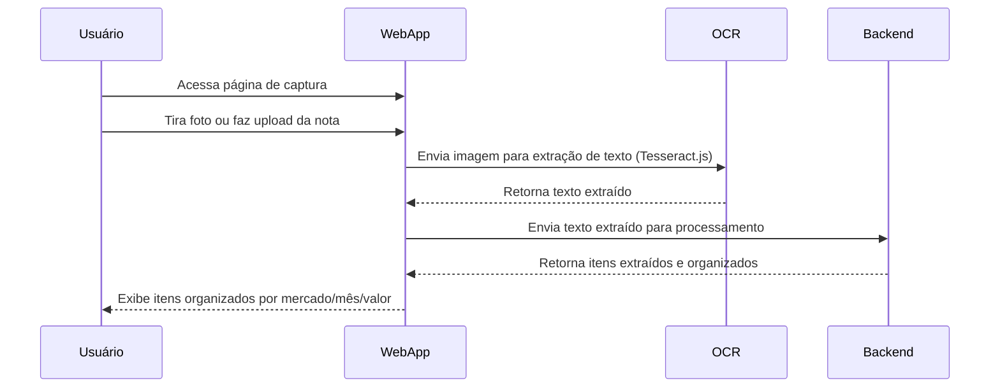

# Diagrama de Sequência: Fluxo de Captura da Imagem da Nota Fiscal

Este diagrama ilustra o fluxo principal desde a captura/envio da imagem pelo usuário até a exibição dos itens extraídos e organizados.

---
*Diagrama gerado para ilustrar o fluxo de captura e extração de dados da nota fiscal.* 